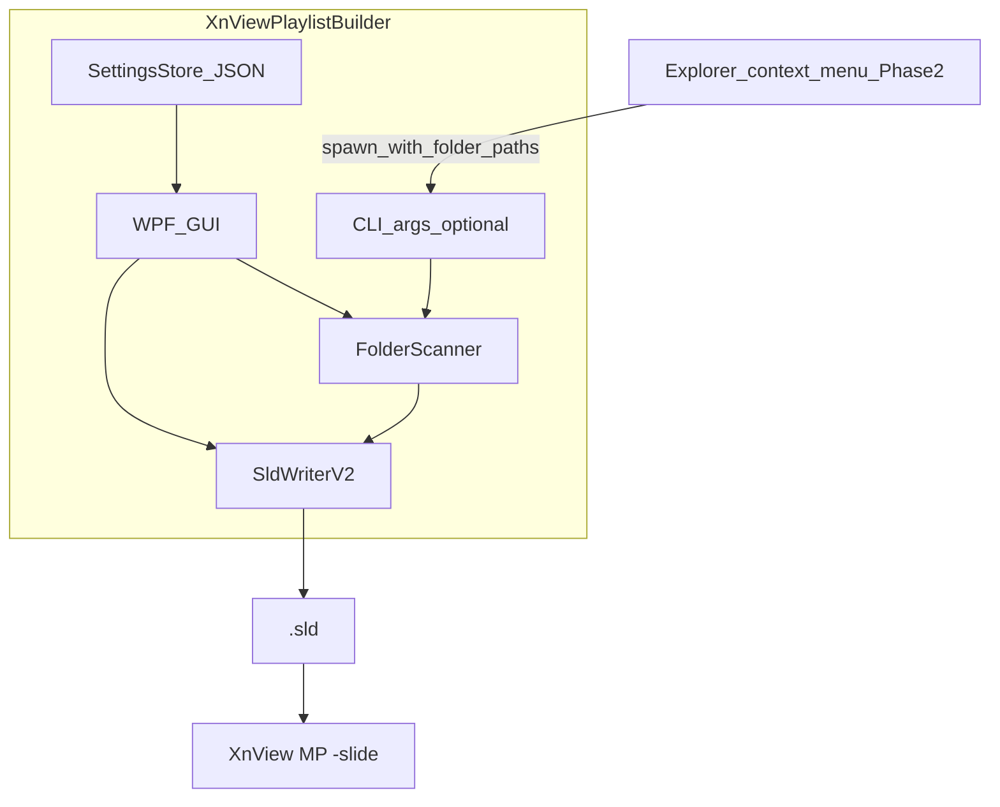

# Technical Specification — XnView Playlist Builder

## Overview

Windows desktop tool that scans one or more image folders and writes XnView MP-compatible `.sld` slideshow playlist files (format v2). Optional Phase 2 Explorer integration launches the same application with pre-selected folder paths.

## Architecture Options Considered

| Approach | Verdict |
|----------|---------|
| Shell extension only | Rejected — insufficient UI for 22 slideshow options; high COM/signing cost |
| GUI only | Acceptable MVP — misses ideal Explorer workflow |
| **Hybrid, GUI-first** | **Selected** — single writer core; extension is launcher only |



### Recommended stack

- **GUI:** C# / .NET 8 + WPF
- **Shell (Phase 2):** Sparse package + `IExplorerCommand` (see [Microsoft Learn — Integrate with File Explorer](https://learn.microsoft.com/en-us/windows/apps/desktop/modernize/integrate-packaged-app-with-file-explorer))
- **Persistence:** JSON in `%AppData%\XnViewPlaylistBuilder\`

Alternatives documented in [`PLANNING_QUESTIONS.md`](PLANNING_QUESTIONS.md): Rust + Tauri 2, Python + PySide6.

## Data Model

Conceptual types (implementation language may differ):

```
SldOptionsV2 {
  useTimer, timer, loop, fullScreen,
  winWidth, winHeight, stretch, randomOrder,
  showInfo, info, titleBar, onTop, cursorAutoHide,
  backgroundColor, textColor, useTextBackColor,
  textPosition, textBackColor, opacity,
  font, effectDuration, effects[]
}

FolderSource {
  absolutePath: string
  includeSubfolders: bool
}

MediaEntry {
  absolutePath: string   // canonical path used for de-dupe
  sourceRootIndex: int   // which FolderSource added this file
}

PlaylistProject {
  options: SldOptionsV2
  sources: FolderSource[]
  entries: MediaEntry[]      // populated after scan
  pathPolicy: PathPolicy
  anchorPath?: string        // for RelativeToAnchor
  outputPath?: string        // target .sld path (for RelativeToSld)
}

enum PathPolicy {
  AbsoluteLocal,
  AbsoluteUnc,        // preserve \\server\share\...
  RelativeToSld,
  RelativeToAnchor
}
```

### Settings store (`settings.json`)

```json
{
  "lastBrowseFolder": "D:\\media\\...",
  "lastSaveFolder": "D:\\playlists\\...",
  "xnviewMpPath": "C:\\Program Files\\XnViewMP\\xnviewmp.exe",
  "defaultOptions": { },
  "defaultPathPolicy": "AbsoluteLocal",
  "imageExtensions": [".jpg", ".jpeg", ".png", ".gif", ".webp", ".bmp", ".tif", ".tiff"]
}
```

## `.sld` v2 Option Schema

Reverse-engineered from [`tests/fixtures/golden-test.sld`](../tests/fixtures/golden-test.sld) and real-world UNC samples.

| Key | Type | golden-test.sld | UNC sample | Writer notes |
|-----|------|----------|-------|--------------|
| *(header)* | literal | `# Slide Show Sequence v2` | same | Must be line 1 |
| UseTimer | bool 0/1 | 1 | 1 | |
| Timer | int | 15 | 15 | Seconds |
| Loop | bool | 1 | 1 | |
| FullScreen | bool | 1 | 1 | |
| WinWidth | int | 640 | 640 | Pixels |
| WinHeight | int | 480 | 480 | Pixels |
| Stretch | bool | 1 | 1 | |
| RandomOrder | bool | 1 | 1 | |
| ShowInfo | bool | 1 | 0 | |
| Info | string | `{Folder name} {Filename}` | `{Filename}` | XnView template tokens; padding in sample is cosmetic |
| TitleBar | bool | 0 | 0 | |
| OnTop | bool | 0 | 0 | |
| CursorAutoHide | bool | 0 | 0 | |
| BackgroundColor | RGBA | `0 0 0 255` | same | Four space-separated ints |
| TextColor | RGBA | `255 255 255 255` | same | |
| UseTextBackColor | bool | 0 | 0 | |
| TextPosition | int | 0 | 0 | Row-major 3×3: 0=top-left, 1=top-center, 2=top-right, 3=left-center, 4=center, 5=right-center, 6=bottom-left, 7=bottom-center, 8=bottom-right |
| TextBackColor | RGBA | `128 128 128 255` | same | |
| Opacity | int | 100 | 100 | Likely 0–100 |
| Font | string | `Trebuchet MS,8,-1,5,50,0,0,0,0,0` | `MS Shell Dlg 2,8.25,-1,5,50,0,0,0,0,0` | Qt-style font serialization |
| EffectDuration | int | 1000 | 1000 | Milliseconds |
| Effects | int[] | `1 2 3 … 56` | same | Space-separated; sample has trailing space |

### Path body

| Sample | Pattern | Redacted example |
|--------|---------|------------------|
| golden-test.sld | Partial fragment (no drive) | `"FolderName\Subfolder\file.jpg"` |
| UNC sample | UNC absolute | `"\\server\share\path\file.jpg"` |

Both samples list **one quoted file path per line** after the options block. No blank line between last option and first path.

## `.sld` Writer Contract

This contract is the authoritative output specification for implementation and tests.

### 1. File structure

| Section | Rule |
|---------|------|
| Line 1 | Exactly `# Slide Show Sequence v2` |
| Lines 2–N | Options: `Key = value` (space around `=` as in samples) |
| Separator | **No** blank line between options and paths |
| Lines N+1… | One `"path"` per line |
| Line endings | CRLF (`\r\n`) |
| Encoding | **(UNVERIFIED — needs spike)** — verify via XnView round-trip |

### 2. Option serialization rules

- **Booleans:** `0` or `1` (never `true`/`false`).
- **Integers:** decimal, no units in file.
- **Colors:** `R G B A` — four integers, space-separated (e.g. `0 0 0 255`).
- **Effects:** space-separated effect IDs; trailing space after last ID is optional (samples include it).
- **Font / Info:** write string value as-is after `= `; do not add extra quoting.
- **Key order:** emit keys in the order listed in the schema table above (matches both samples).
- **Defaults:** when operator has not changed an option, emit sample-compatible defaults (ShowInfo=0, Info=`{Filename}`, Font=system default string).

### 3. Path quoting and escaping

- Wrap each path in ASCII double quotes: `"path"`.
- Use backslash `\` as path separator on Windows.
- Apply path policy **before** quoting (see below).
- Internal `"` in path: escape as `\"` — **(UNVERIFIED — needs spike)**; reject or sanitize paths containing `"` in MVP if spike not done.
- Do not emit bare paths without quotes.

### 4. Path policy application

| Policy | Transform |
|--------|-----------|
| AbsoluteLocal | `Path.GetFullPath(absolutePath)` for non-UNC paths |
| AbsoluteUnc | If path starts with `\\`, write unchanged (normalized slashes only) |
| RelativeToSld | `Path.GetRelativePath(Path.GetDirectoryName(outputPath), absolutePath)` |
| RelativeToAnchor | `Path.GetRelativePath(anchorPath, absolutePath)` |

**Fragment paths** (partial paths without drive letter): not emitted by default; legacy behavior base path is **(UNVERIFIED — needs spike)**.

### 5. Entry ordering

1. Process `FolderSource` list in UI add order.
2. For each source, scan files depth-first.
3. Sort files within each directory: ordinal case-insensitive by filename.
4. De-duplicate by normalized full path (first occurrence wins).
5. Do not sort globally across sources unless operator selects “sort all A–Z” (future option).

### 6. Folder scan rules

- Include only files matching configured extensions (case-insensitive).
- Skip hidden/system files unless operator opts in (future).
- Follow directory symlinks: **off** by default **(UNVERIFIED — needs spike)**.
- Report count: files added, duplicates skipped, directories scanned.

### 7. Validation before write

- At least one media entry.
- Output path ends with `.sld`.
- All entries resolve to existing files at save time (warn on missing, do not write broken paths silently).
- Options block complete — all 22 keys present (XnView may not fall back to ini for missing keys, [t=2870](https://forum.xnview.com/viewtopic.php?t=2870)).

## Integration Points

### XnView MP

| Integration | Detail |
|-------------|--------|
| Launch slideshow | `"<xnviewmp.exe>" -slide "<playlist.sld>"` |
| Discover exe path | Common install dirs + operator override in settings |
| Verify playback | Manual: File → Open `.sld` or CLI `-slide` |

Command-line reference: XnView MP **Help → About → Command line** tab ([forum t=47192](https://forum.xnview.com/viewtopic.php?t=47192)).

### Explorer shell extension (Phase 2)

| Item | Detail |
|------|--------|
| Mechanism | Sparse package + `desktop4:FileExplorerContextMenus` + `IExplorerCommand` |
| Registration | Signed MSIX; `Directory` item type for folder multi-select |
| Behavior | Spawn GUI: `XnViewPlaylistBuilder.exe --add %V` (exact arg parsing TBD) |
| Complexity | COM server, manifest, code signing; Win11 “Show more options” menu may differ for directories ([SO 78109741](https://stackoverflow.com/questions/78109741)) |
| MVP | **Not required** |

### CLI (optional Phase 0 aid)

```
XnViewPlaylistBuilder.exe --add "D:\photos\a" "D:\photos\b" --out "D:\out.sld" --recursive
```

Useful for scripted verification before GUI is complete.

## Shell Extension — Honest Assessment

| Factor | Impact |
|--------|--------|
| Development time | High — COM, manifest, sparse package, signing |
| Windows 11 UX | New compact menu vs legacy menu inconsistency for folders |
| Multi-select folders | Supported via shell item arrays |
| Signing | Required for reliable registration on modern Windows |
| Maintenance | Separate build artifact; must track OS manifest schema changes |

**Recommendation:** Prove `.sld` writer in GUI first. Add shell verb only after Phase 0 verification passes.

## Security and Safety

- Tool reads filesystem paths only; does not modify image files.
- Shell extension receives only paths explicitly selected by operator.
- No elevation required for normal operation.
- Settings JSON in user `%AppData%` — no secrets expected.

## Out of Scope (Technical)

- Parsing/editing existing large `.sld` files for merge (Phase 3 nice-to-have).
- Watching folders for changes (FSW).
- Network authentication beyond what Windows already provides for UNC paths.

## References

- Sample files: [`tests/fixtures/golden-test.sld`](../tests/fixtures/golden-test.sld), [`tests/fixtures/official-example.sld`](../tests/fixtures/official-example.sld)
- Research log: [`.planning/xnview-playlist-builder/findings.md`](../.planning/xnview-playlist-builder/findings.md)
- Product scope: [`PRODUCT.md`](PRODUCT.md)
- Delivery phases: [`MVP_PLAN.md`](MVP_PLAN.md)
